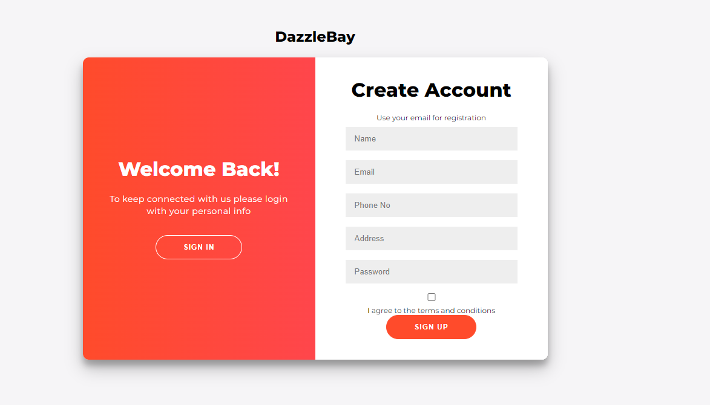
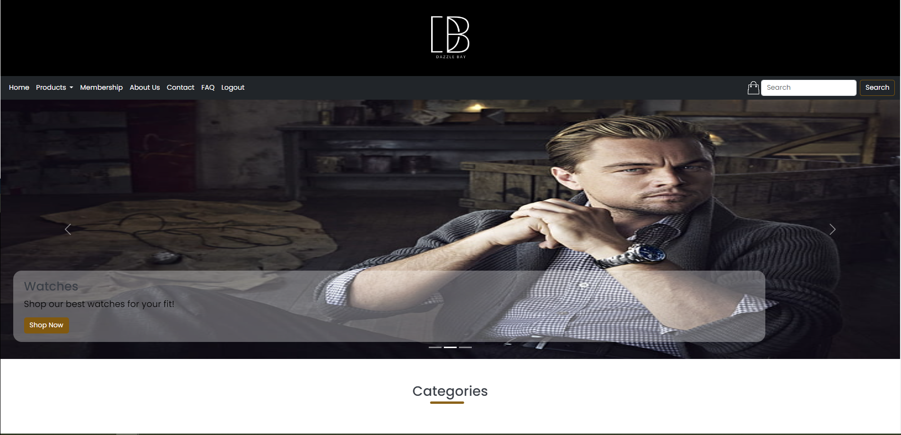
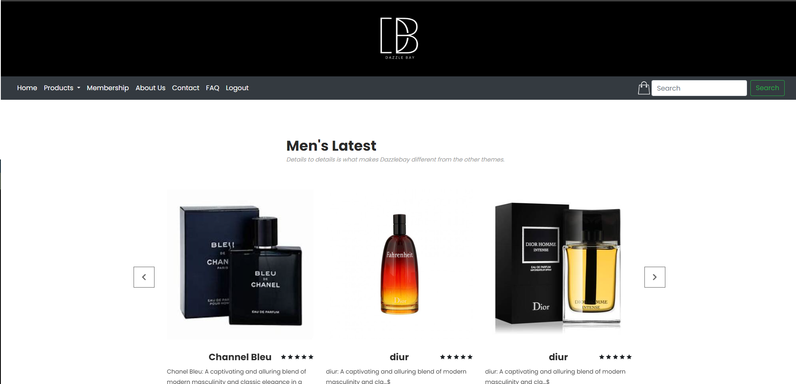
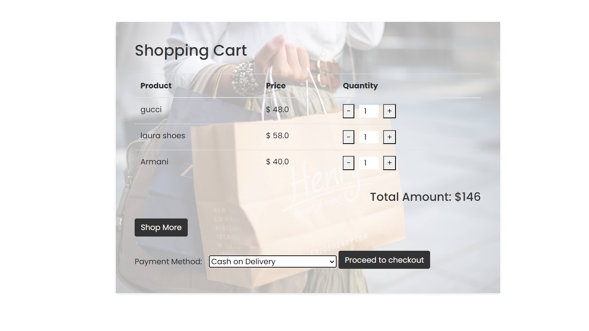

                                                DazzleBay E-Commerce Platform 

Overview:

DazzleBay is an innovative web-based e-commerce platform developed using Flask, HTML, CSS, Bootstrap, JavaScript, jQuery, and MongoDB. It offers users a convenient way to purchase a variety of products from watches and clothes to perfumes and more, all from the comfort of their homes.

Features:

User-Friendly Interface: Navigate through a visually appealing and easy-to-use interface designed with HTML, CSS, and Bootstrap.

Wide Range of Products: Browse through a diverse selection of items categorized for both men and women, ensuring a comprehensive shopping experience.

Special Packaging Options: Choose from special packaging options for different occasions or specify custom requirements.

Secure Payments: Select from a range of payment methods for a secure and hassle-free checkout process.

Doorstep Delivery: Enjoy the convenience of doorstep delivery, ensuring a seamless end-to-end shopping experience.

Technologies Used:

Frontend: HTML, CSS, Bootstrap, JavaScript, jQuery
Backend: Flask (Python framework)
Database: MongoDB

Signup/Login Page

Home Page

Products

Bill and Payment

